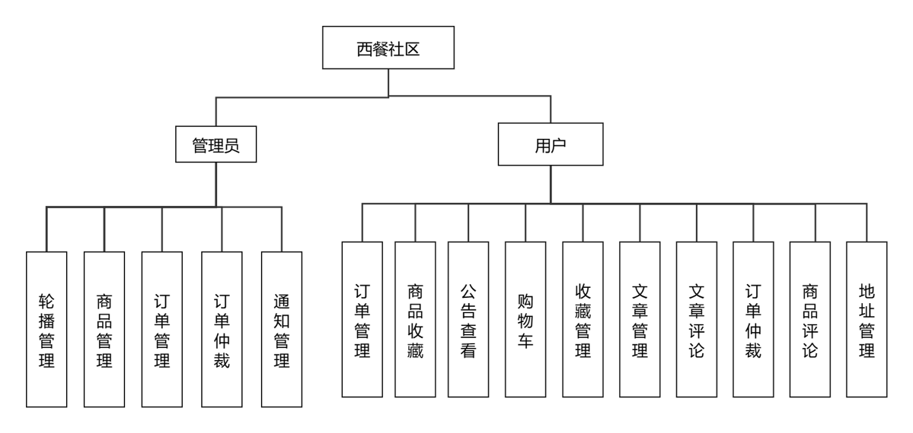

# 基于Vue的西餐制作交流Web App的设计与实现

## 系统说明

**系统包含论文 1 篇付费提供**

## 功能

参照文件夹中的答辩 PPT、开题报告、和毕设手册
系统内 2 个权限：用户、管理员。系统可以为其他商城(博客)，只需替换上传内容即可。无需限制为西餐社区。
可以修改为其他商品的商品。功能主要为博客社区和商城



[演示视频](https://disk.blogweb.cn/video/%E5%9F%BA%E4%BA%8EVue%E7%9A%84%E8%A5%BF%E9%A4%90%E5%88%B6%E4%BD%9C%E4%BA%A4%E6%B5%81Web%20App%E7%9A%84%E8%AE%BE%E8%AE%A1%E4%B8%8E%E5%AE%9E%E7%8E%B0.mp4 "演示视频")

## 相关技术

前端:Vue.js、Vite、Tailwind CSS、Element Plus、Vant UI
服务端:Koa2
数据库:MySQL

## 其他版本

付费提供部分其他毕设程序、论文的成品，同时可以定制和讲解毕设，联系下方联系方式即可

可联系 QQ:1974109227 微信:webzhizhuo

## 联系方式

可以开发其他项目、毕业设计、毕业论文等

<div>
    
    
</div>

### 启动

#### 环境

1. Node.js 20+
2. MySQL 8.x

#### 启动步骤

1. 如果项目代码中有 start.bat 则双击执行

否则运行以下命令安装 yarn 以及部分插件同时进行换源

```bash
npm config set registry https://registry.npmmirror.com/&&npm i yarn vite nodemon -g&&yarn config set registry https://registry.npmmirror.com/
```

2. 如果项目代码中有 install.bat 则双击运行否则

通常 admin/font 是前端，server/api 是服务端，cd 进入前端或者服务器文件夹，文件夹名称并不固定

```bash
cd server

yarn
```

```bash
cd admin

yarn
```

3. 如果有 dev.bat 则双击运行，否则 cd 进入文件夹都使用`yarn dev`运行
